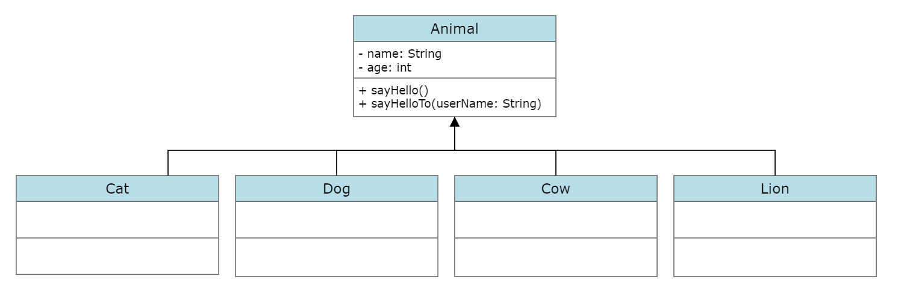

# inheritance

# 2. Feladat: öröklés beveztése
Az előző feladatban látott megoldás nagyon sok kódduplikációval és egyéb fejfájással jár.
Ennek orvoslására öröklést tudunk használni, ami az objektumorientált programozás egyik fő koncepciója.
Az öröklés lehetővé teszi az osztályok közötti hierarchikus kapcsolatok létrehozását.
Az öröklés révén egy osztály (leszármazott osztály) örökölheti egy másik osztály (szülő osztály) 
tulajdonságait és viselkedését.

Vezessünk be egy közös ősosztályt a `Cat`, `Dog`, `Cow`, `Lion` osztályoknak `Animal` néven!
Ha kimodnjuk, hogy a `Cat`, `Dog`, `Cow`, `Lion` osztályok ebből az osztályból származnak le,
akkor azok megörölik az `Animal` osztály fieldjeit és metódusait, így elég lesz azokat csak egy helyen
nyílvántartani, a többi osztályt gyakorlatilag üresen hagyhatjuk.

Készíts egy `Animal` osztályt és másold bele a `Cat` osztály kódját:
```
public class Animal {

    private String name;
    private int age;

    public void sayHello() {
        System.out.println("Hello, my name is " + this.name + "!");
    }

    public void sayHelloTo(String userName) {
        System.out.println("Hi, " + userName + "! Nice to meet you, I am " + this.name + "!");
    }

    public String getName() {
        return name;
    }

    public void setName(String name) {
        this.name = name;
    }

    public int getAge() {
        return age;
    }

    public void setAge(int age) {
        this.age = age;
    }
}
```

A `Cat` osztályból pedig törölj ki minden kódot, csak ennyi maradjon:
```
public class Cat {}
```

A példányosított cica objektumunk viszont most nem fordul, egy apró változtatásra még szükségünk van!

Valahogy tudatnunk kell a fordítóval, hogy mi egy öröklést, (egy hierarchikus viszonyt)
szeretnénk látni a `Cat` és az `Animal` osztályaink között.

Ehhez az extends kulcsszót kell alkalmaznunk a leszármazott ("gyerek") osztályunkban:
```
public class Cat extends Animal {}
```
Ezzel azt mondjuk ki, hogy a `Cat` leszármazik az `Animal` osztályból, ezzel megörökölve minden tulajdonságát
és viselkedését.

Tedd meg ugyanezt a `Dog`, `Cow` és `Lion` osztályokra is!


**A meglévő osztályaink UML osztálydiagramja jelenleg így néz ki:**
